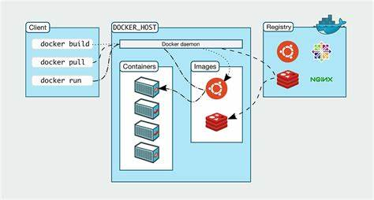
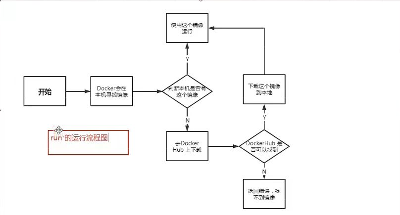
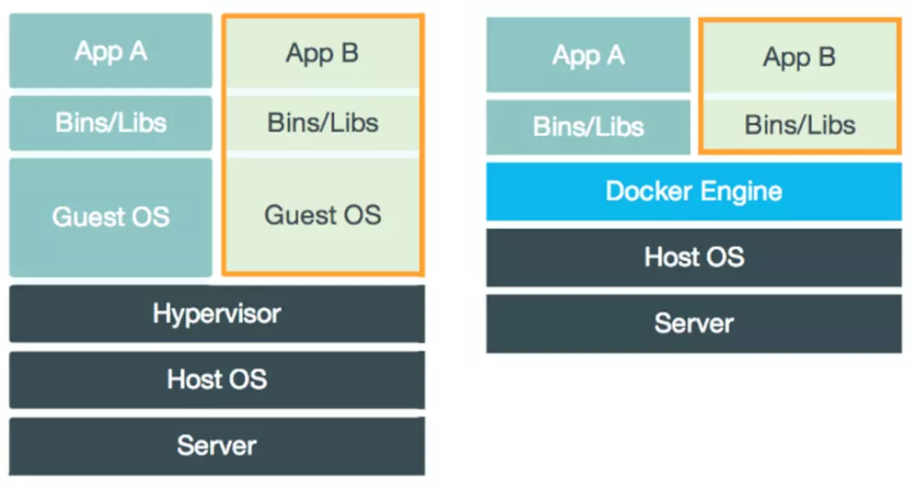
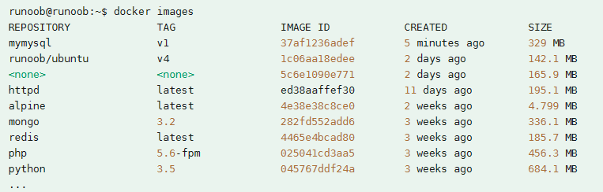
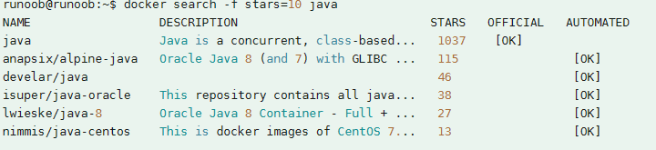
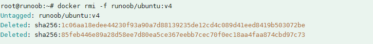
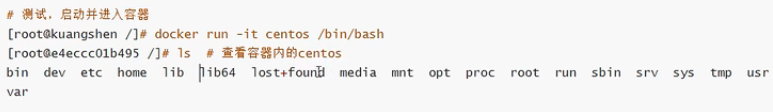
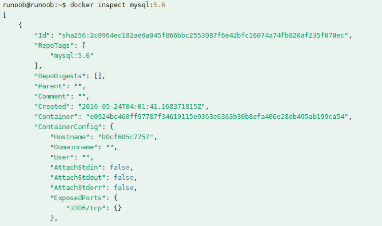
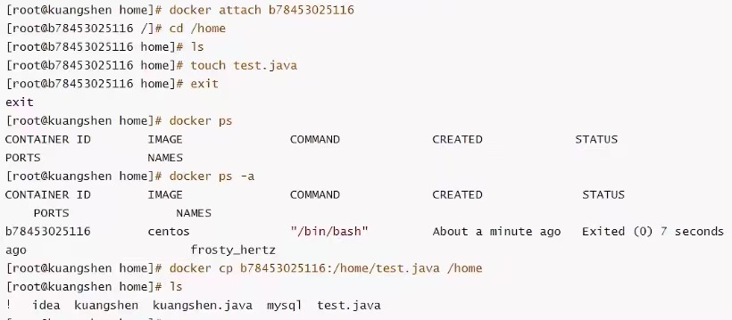

# Docker是什么

Docker是一个开源平台，通过将应用程序隔离到轻量级、可移植的容器中，自动化应用程序的部署、扩展和管理。容器是独立的可执行单元，封装了运行应用程序所需的所有必要依赖项、库和配置文件，可以在各种环境中稳定地运行。



# 相关名词概念

镜像(image)：Docker镜像好比是一个模板，可以通过这个模板来创建容器服务，tomcat镜像===>run==>tomcat01容器（提供服务器）。通过这个镜像可以创建多个容器（服务运行或项目运行是在容器中）

容器(container)：Docker利用容器技术，独立运行一个或一个组应用，通过镜像来创建。 可以把这个容器理解为一个简易的linux系统

仓库(repository)：存放镜像的地方。仓库分为公有仓库和私有仓库。

Docker_Hub(默认是国外的)，要利用国内容器服务器配置镜像加速。

# 安装Docker

# Docker原理



**Docker是怎么工作的？**

Docker是一个Client-Server结构的系统，Docker的守护进程运行在主机上。通过Socket从客户端访问。

Docker/Server接收到Docker-Client的指令，就会执行这个命令。

**Docker为什么比虚拟机快？**

1. Docker有比虚拟机更少的抽象层。



2. Docker利用的是宿主机的内核，虚拟机需要是Guest OS。所以，新建一个容器的时候，Docker不需要像虚拟机一样重新加载一个操作系统内核，避免引导。虚拟机是加载Guest OS，分钟级别的，而Docker是利用宿主机的操作系统，省略了这个复杂的过程，秒级别。

# 基本命令
注：可选项可以任意组合。
## 帮助命令

```shell
docker version # 查看版本
docker info # 查看docker系统信息，包括镜像和容器数量
docker 命令 --help #帮助命令
```
帮助文档地址：https://docs.docker.com/engine/reference/run/

## 镜像基本命令

```shell
docker images #查看所有本地主机上的镜像
```

```shell
#解释
REPOSITORY 镜像的仓库源
TAG        镜像的标签
IMAGE ID   镜像的id
CREATED    镜像的创建时间
SIZE       镜像的大小
# 可选项
-a, --all   列出所有的镜像
-q, --quiet 只显示镜像的id
```
```shell
docker search [过滤项] 镜像名 # 搜索镜像
```

```shell
# 可选项
-f, --filter 列出收藏数不小于指定值的镜像
```
```shell
docker pull 镜像名[:tag]  #下载镜像
$ docker pull ubuntu:14.04          # 如果不写tag默认是latest

14.04: Pulling from library/ubuntu
5a132a7e7af1: Pull complete         # 分层下载, docker image的核心, 联合文件系统
fd2731e4c50c: Pull complete
28a2f68d1120: Pull complete
a3ed95caeb02: Pull complete
Digest: sha256:45b23dee08af5e43a7fea6c4cf9c25ccf269ee113168c19722f87876677c5cb2  # 签名
Status: Downloaded newer image for ubuntu:14.04
docker.io/library/ubuntu:18.04      # 真实地址                            
```
```shell
docker rmi -f 镜像id/镜像仓库源  # 删除镜像
docker rmi -f 镜像id 镜像id  # 删除多个镜像
docker rmi -f $(docker images -aq) # 删除所有镜像
```


## 容器基本命令

我们有了镜像才可以创建容器。
```shell
docker run [可选项] image # 新建容器并启动
```
```shell
# 可选项
--name="Name"  # 容器名称 
-d             # 后台方式运行
-it            # 交互方式运行，进入容器查看内容
-p             # 指定容器端口 -p 8080:8080
    -p ip:主机端口:容器端口
    -p 主机端口:容器端口（常用）
    -p 容器端口
    容器端口
-P             # 随机指定端口
```

```shell
exit           # 容器停止并退出，从容器退回主机
Ctrl+P+Q       # 容器不停止退出
```
```shell
docker ps [可选项]  # 列出所有正在运行的容器
```
```shell
# 可选项
-a             # 列出曾经运行过的容器和现在正在运行的所有容器
-n=[number]    # 显示最近创建的容器,number表示个数
-q             # 只显示容器的编号
```
```shell
docker rm 容器id # 删除容器，不能删除正在运行的容器
docker rm -f 容器id # 强制删除容器
docker rm -f $(docker images -aq) # 删除所有容器
docker ps -a -q|xargs docker rm # 删除所有容器
```
```shell
docker start 容器id   # 启动容器
docker restart 容器id # 重启容器
docker stop 容器id    # 停止当前正在运行的容器
docker kill 容器id    # 强制停止当前正在运行的容器
```
## 常用其他命令
问题：后台运行容器时（run -d），通过ps发现容器停止了。
原因：docker容器后台运行时，必须有一个前台进程。docker没有发现提供服务，会自动停止，就是没有程序了。

```shell
docker logs -f -t --tail 容器id # 查看全部日志
docker logs -tf --tail number 容器id # number表示条数
```
如果没有日志，自己写一段shell脚本
```shell
while ture;do echo kuangshen;sleep 1;done
docker run -d centos/bin/sh -c "while ture;do echo kuangshen;sleep 1;done"
```
```shell
docker top 容器id # 查看容器进程信息
```
```shell
docker inspect 容器/镜像id # 查看容器/镜像信息
```


**进入正在运行的容器**

我们通常容器都是使用后台方式运行的，需要进入容器，修改一些配置
```shell
docker exec -it 容器id /bin/bash   # 方式1，进入容器后开启一个新的终端，可以在里面操作
docker attach -it 容器id           # 方式2，进入容器正在执行的终端，不会启动新的进程
```
```shell
docker cp 容器id:容器内路径 主机目标路径 # 容器内拷贝到主机上
# 步骤
docker attach -it 容器id 
cd /home
touch test.java
ls
exit
docker cp 容器id:/home/test.java /home
ls
```


拷贝是一个手动过程，未来我们使用-v卷的技术，可以实现。

# 可视化管理工具
## potainer(常用)
Docker图形化管理工具，提供一个后台供我们操作。

```shell
docker run -d -p 8080:9000 \
```
访问测试 http://ip.8080/


## Rancher(CI/CD用)

# 镜像原理

## 镜像是什么

镜像是一种轻量级，可执行的独立软件包，用来打包软件运行环境和基于运行环境开发的软件。它包含运行某个软件所需的所有内容，包括代码，运行时，库，环境变量和配置文件。所有应用直接打包部署。

如何得到镜像：
1. 从远程仓库下载
2. 拷贝
3. 自己制作一个镜像

## 镜像加载原理

### UnionFS（联合文件系统）

我们下载的时候看到一层一层的就是这个。
UnionFS是一种分层的轻量级且高性能的文件系统，它支持对文件系统的修改作为一次提交来一层层的叠加，同时可以将不同目录挂载到同一个虚拟文件系统下。

特性：一次加载多个文件系统，但从外面看起来，只能看到一个文件系统，联合加载会把各层文件系统叠加起来，这样最终的文件系统会包含所有底层的文件和目录。

### Docker镜像加载原理

Docker镜像实际上由一层一层的文件系统组成，这种层级的文件系统就是UnionFS。

bootfs

rootfs